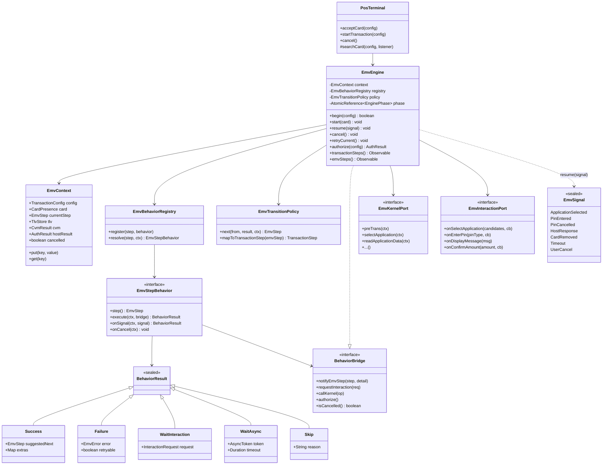
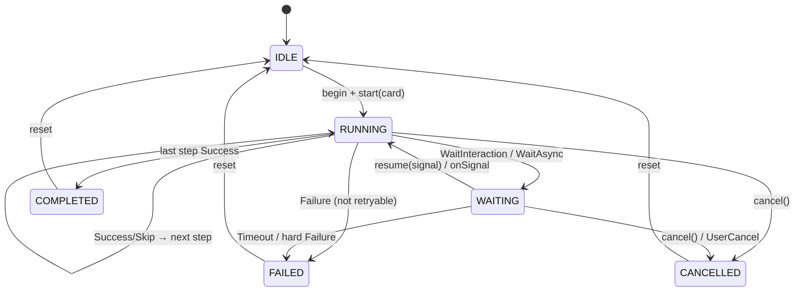
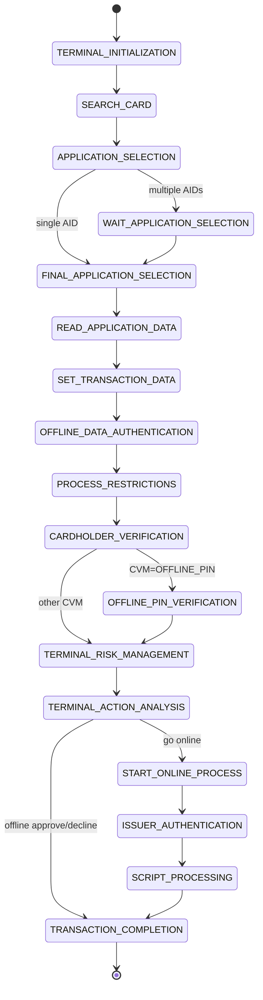
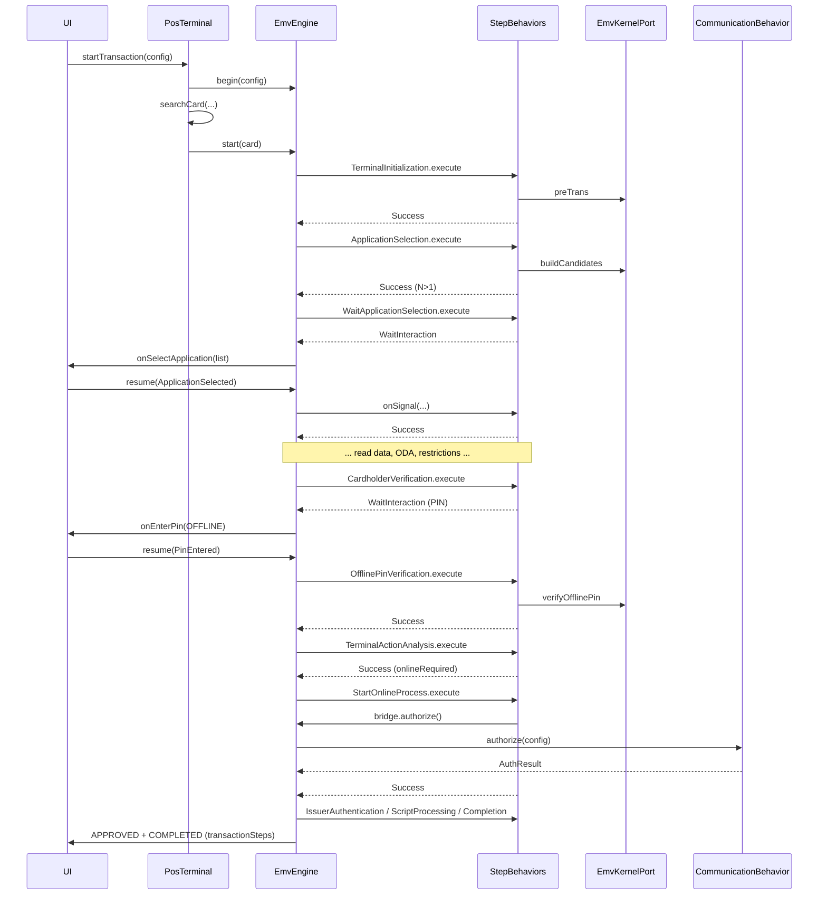

# EMV Behavior-Driven Architecture

**Status:** Implementation in progress (core contracts + engine orchestrator + Fake vertical slice)  
**Audience:** POS / EMV engineers integrating contact, contactless, mag, and online flows  
**Goal:** Replace monolithic vendor EMV logic with isolated, testable step behaviors orchestrated by a central engine

---

## 1. Problem with the current model

Today the app-facing stack is:

```text
UI → PosTerminal → EmvBehavior.start()  (vendor god-object)
                 → EmvEngine             (thin Rx event bus)
```

`EmvStep` already names the EMV phases, but those values are **reporting labels**, not executable units. Real progression lives inside vendor classes (especially `PaxEmvBehavior`) driven by kernel callbacks. That yields:

| Pain | Consequence |
|------|-------------|
| One large vendor class owns all phases | Hard to test, review, and reuse |
| Transitions are implicit in callbacks | No single place to reason about order |
| Host / PIN / UI async mixed into EMV | Tight coupling to Android UI and network |
| Adding a step requires editing the god-object | Violates Open/Closed |
| Fake / Ingenico must re-implement the whole flow | Duplication across vendors |

This design promotes every `EmvStep` to an independent **behavior**, with `EmvEngine` as a real orchestrator (state machine), not only an event bus.

---

## 2. Overall architecture

### 2.1 Layered view

```text
┌─────────────────────────────────────────────────────────────────┐
│  UI / Presentation (Activities, Fragments, Compose)             │
│  Observes TransactionStep + EmvStep events; answers prompts     │
└───────────────────────────────┬─────────────────────────────────┘
                                │ EmvInteractionPort (callbacks)
┌───────────────────────────────▼─────────────────────────────────┐
│  PosTerminal  (public API: acceptCard / startTransaction)       │
│  Owns: searchCard, CommunicationBehavior, PrinterBehavior       │
└───────────────────────────────┬─────────────────────────────────┘
                                │
┌───────────────────────────────▼─────────────────────────────────┐
│  EmvEngine  (orchestrator / state machine)                      │
│  • Holds EmvContext                                             │
│  • Resolves EmvStep → EmvStepBehavior via EmvBehaviorRegistry   │
│  • Applies EmvTransitionPolicy                                  │
│  • Publishes events; handles cancel / retry / timeout           │
└───────────┬─────────────────────┬─────────────────┬─────────────┘
            │                     │                 │
            ▼                     ▼                 ▼
   EmvStepBehavior[]     EmvKernelPort      EmvHostPort /
   (one per EmvStep)     (vendor L2)        InteractionPort
```

### 2.2 Design patterns (combined)

| Pattern | Role in this design |
|---------|---------------------|
| **State / Behavior** | Each `EmvStepBehavior` is the active state for one EMV phase |
| **Strategy** | Registry selects the behavior implementation per step (and optionally per entry method) |
| **Command** | `execute(ctx)` is a self-contained command; results are immutable outcomes |
| **Mediator** | `EmvEngine` mediates between behaviors, UI, kernel, and host — behaviors never talk to each other |
| **Observer** | Rx subjects publish `EmvStepEvent` / `TransactionStepEvent` to UI |
| **Ports & Adapters** | Kernel, PIN pad, host, and UI are ports; PAX/Ingenico/Fake are adapters |

Behaviors **do not** call the next behavior directly. They return an outcome; the engine advances. That preserves isolation and Open/Closed.

---

## 3. UML / class diagram

### 3.1 Core orchestration



### 3.2 Per-step behaviors (one class each — single `execute()`)

Each EMV phase is an independent class. The engine never inlines phase logic; it only calls `execute` / `onSignal`.

```mermaid
classDiagram
    EmvStepBehavior <|.. TerminalInitializationBehavior
    EmvStepBehavior <|.. SearchCardBehavior
    EmvStepBehavior <|.. ApplicationSelectionBehavior
    EmvStepBehavior <|.. WaitApplicationSelectionBehavior
    EmvStepBehavior <|.. FinalApplicationSelectionBehavior
    EmvStepBehavior <|.. ReadApplicationDataBehavior
    EmvStepBehavior <|.. SetTransactionDataBehavior
    EmvStepBehavior <|.. OfflineDataAuthenticationBehavior
    EmvStepBehavior <|.. ProcessRestrictionsBehavior
    EmvStepBehavior <|.. CardholderVerificationBehavior
    EmvStepBehavior <|.. OfflinePinVerificationBehavior
    EmvStepBehavior <|.. TerminalRiskManagementBehavior
    EmvStepBehavior <|.. TerminalActionAnalysisBehavior
    EmvStepBehavior <|.. StartOnlineProcessBehavior
    EmvStepBehavior <|.. IssuerAuthenticationBehavior
    EmvStepBehavior <|.. ScriptProcessingBehavior
    EmvStepBehavior <|.. TransactionCompletionBehavior
```



| EmvStep | Behavior class | Entry method |
|---------|----------------|--------------|
| `TERMINAL_INITIALIZATION` | `TerminalInitializationBehavior` | `execute()` |
| `SEARCH_CARD` | `SearchCardBehavior` | `execute()` |
| `APPLICATION_SELECTION` | `ApplicationSelectionBehavior` | `execute()` |
| `WAIT_APPLICATION_SELECTION` | `WaitApplicationSelectionBehavior` | `execute()` → often `WaitInteraction` |
| `FINAL_APPLICATION_SELECTION` | `FinalApplicationSelectionBehavior` | `execute()` |
| `READ_APPLICATION_DATA` | `ReadApplicationDataBehavior` | `execute()` |
| `SET_TRANSACTION_DATA` | `SetTransactionDataBehavior` | `execute()` |
| `OFFLINE_DATA_AUTHENTICATION` | `OfflineDataAuthenticationBehavior` | `execute()` |
| `PROCESS_RESTRICTIONS` | `ProcessRestrictionsBehavior` | `execute()` |
| `CARDHOLDER_VERIFICATION` | `CardholderVerificationBehavior` | `execute()` / `onSignal()` |
| `OFFLINE_PIN_VERIFICATION` | `OfflinePinVerificationBehavior` | `execute()` / `onSignal()` |
| `TERMINAL_RISK_MANAGEMENT` | `TerminalRiskManagementBehavior` | `execute()` |
| `TERMINAL_ACTION_ANALYSIS` | `TerminalActionAnalysisBehavior` | `execute()` |
| `START_ONLINE_PROCESS` | `StartOnlineProcessBehavior` | `execute()` → often `WaitAsync` |
| `ISSUER_AUTHENTICATION` | `IssuerAuthenticationBehavior` | `execute()` |
| `SCRIPT_PROCESSING` | `ScriptProcessingBehavior` | `execute()` / `onSignal()` |
| `TRANSACTION_COMPLETION` | `TransactionCompletionBehavior` | `execute()` |

### 3.3 State machine — engine + step graph

Engine lifecycle (orthogonal to `EmvStep`):



Default contact chip transition graph (policy-owned; behaviors only write context facts):



---

## 4. Responsibilities of every class

### 4.1 Orchestration

| Class | Responsibility |
|-------|----------------|
| **`PosTerminal`** | Public POS API. Owns card search, attaches host/printer ports, starts/cancels the engine. Does **not** contain EMV phase logic. |
| **`EmvEngine`** | Central state machine. Resolves the current behavior, runs it, interprets `BehaviorResult`, publishes events, resumes on signals, enforces single in-flight transaction, applies cancel/timeout/retry. |
| **`EmvContext`** | Mutable per-transaction blackboard: config, card presence, TLV/tag store, CVM outcome, host auth result, flags (`cancelled`, `onlineRequired`, entry method). Shared by all behaviors; never holds UI or Android `Context`. |
| **`EmvBehaviorRegistry`** | Maps `EmvStep` → `EmvStepBehavior`. Can resolve variants by entry method (contact vs CLSS vs mag). New steps register here — existing behaviors untouched. |
| **`EmvTransitionPolicy`** | Pure rules: given `(currentStep, result, context)` return the next `EmvStep` (or terminal). Also maps fine `EmvStep` → coarse `TransactionStep` for UI. No I/O. |

### 4.2 Behavior contract

| Class | Responsibility |
|-------|----------------|
| **`EmvStepBehavior`** | Contract for one EMV phase. `execute` runs sync work or starts async work; `onSignal` continues after UI/kernel/host events; `onCancel` releases resources. |
| **`BehaviorResult`** | Sealed outcome: `Success`, `Failure`, `WaitInteraction`, `WaitAsync`, `Skip`. The **only** way a behavior talks to the engine about control flow. |
| **`BehaviorBridge`** | Narrow facade the engine gives behaviors: notify steps, request interaction, call kernel port, authorize, check cancel. Prevents behaviors from depending on the full engine API. |

### Concrete behaviors (one responsibility each)

| Behavior | Owns |
|----------|------|
| `TerminalInitializationBehavior` | Kernel/param init (`preTrans`), AID/CAPK load, terminal capabilities |
| `SearchCardBehavior` | Optional in-engine search coordination; usually PosTerminal already searched — may `Skip` or validate presence |
| `ApplicationSelectionBehavior` | Candidate list build / PPSE / directory |
| `WaitApplicationSelectionBehavior` | UI candidate picker when multiple AIDs |
| `FinalApplicationSelectionBehavior` | Confirm selected AID with card/kernel |
| `ReadApplicationDataBehavior` | Read records / AFL data into TLV store |
| `SetTransactionDataBehavior` | Amount, date, TVR/TSI seeds, other terminal TLVs |
| `OfflineDataAuthenticationBehavior` | SDA / DDA / CDA |
| `ProcessRestrictionsBehavior` | App version, AUC, effective/expiry dates |
| `CardholderVerificationBehavior` | CVM list processing; may wait for PIN/signature |
| `OfflinePinVerificationBehavior` | Offline PIN verify with PED / card |
| `TerminalRiskManagementBehavior` | Floor limits, random selection, velocity |
| `TerminalActionAnalysisBehavior` | Offline approve / decline / go online decision |
| `StartOnlineProcessBehavior` | Build ARQC path; invoke host via bridge; wait for response |
| `IssuerAuthenticationBehavior` | ARPC / issuer auth data |
| `ScriptProcessingBehavior` | Issuer scripts 71/72 |
| `TransactionCompletionBehavior` | 2nd GENERATE AC, finalize APPROVED/DECLINED, cleanup |

### 4.3 Ports (adapters swap per vendor)

| Port | Responsibility |
|------|----------------|
| **`EmvKernelPort`** | Vendor-neutral L2 operations. PAX implements via `emvservice` / `emvlib`; Fake simulates; Ingenico adapts later. |
| **`EmvInteractionPort`** | UI prompts: app select, PIN, amount confirm, messages. Implemented by app UI layer. |
| **`CommunicationBehavior`** | Host authorization (already exists on PosTerminal). |
| **`PrinterBehavior`** | Receipt printing (already exists). |
| **`EmvSignal`** | Typed async events fed into `EmvEngine.resume(signal)`. |

---

## 5. How behaviors communicate with the EMV engine

Communication is **unidirectional and result-based**:

```text
EmvEngine                         EmvStepBehavior
    │                                    │
    │  execute(ctx, bridge)              │
    │───────────────────────────────────►│
    │                                    │  uses bridge.notifyEmvStep(...)
    │                                    │  uses bridge.callKernel(...)
    │                                    │  uses bridge.requestInteraction(...)
    │◄───────────────────────────────────│
    │         BehaviorResult             │
    │                                    │
    │  (if Wait*)  … later …             │
    │  onSignal(ctx, signal)             │
    │───────────────────────────────────►│
    │◄───────────────────────────────────│
    │         BehaviorResult             │
```

### 5.1 `BehaviorResult` → engine action matrix

| Result | Engine action | Next behavior selected by |
|--------|---------------|---------------------------|
| `Success` | Advance | `EmvTransitionPolicy.next(...)` (honors optional `suggestedNext`) |
| `Skip` | Advance (no failure) | Same policy; treat as successful bypass |
| `WaitInteraction` | Enter `WAITING`; call `EmvInteractionPort` | Same behavior via `onSignal` when UI resumes |
| `WaitAsync` | Enter `WAITING`; arm timeout on `AsyncToken` | Same behavior via `onSignal` when kernel/host completes |
| `Failure` (retryable) | Optionally retry same step | Same behavior `execute` again |
| `Failure` (hard) | Enter `FAILED`; cleanup | None — transaction ends |

Behaviors do **not** “trigger the next step” by instantiating a sibling. They finish successfully; the **engine** triggers the next behavior. That still meets the product goal (“next step runs automatically after success”) while keeping behaviors isolated.

Rules:

1. Behaviors **never** hold a reference to another behavior.
2. Behaviors **never** call `engine.start(nextStep)` with a concrete sibling class.
3. Behaviors may suggest a next step in `Success.suggestedNext` (e.g. skip offline PIN when CVM is signature); the **policy** may accept or override.
4. Side effects that need orchestration (host auth, UI) go through `BehaviorBridge` so the engine can publish matching `TransactionStep` events and enforce cancel/timeout.
5. Existing Rx observers keep working: engine still emits `EmvStepEvent` / `TransactionStepEvent`.
---

## 6. How transitions between EMV steps occur

### 6.1 Default happy path

```text
TERMINAL_INITIALIZATION
  → SEARCH_CARD
  → APPLICATION_SELECTION
  → WAIT_APPLICATION_SELECTION      (Skip if single candidate)
  → FINAL_APPLICATION_SELECTION
  → READ_APPLICATION_DATA
  → SET_TRANSACTION_DATA
  → OFFLINE_DATA_AUTHENTICATION
  → PROCESS_RESTRICTIONS
  → CARDHOLDER_VERIFICATION
  → OFFLINE_PIN_VERIFICATION        (Skip if not required)
  → TERMINAL_RISK_MANAGEMENT
  → TERMINAL_ACTION_ANALYSIS
  → START_ONLINE_PROCESS            (Skip if offline approve)
  → ISSUER_AUTHENTICATION           (Skip if no issuer auth data)
  → SCRIPT_PROCESSING               (Skip if no scripts)
  → TRANSACTION_COMPLETION
```

### 6.2 Transition algorithm (engine)

```text
loop:
  behavior = registry.resolve(context.currentStep, context)
  publish EmvStepEvent(currentStep)
  result = behavior.execute(context, bridge)

  while result is WaitInteraction or WaitAsync:
      park engine in WAITING phase (with timeout)
      signal = await resume(signal) or timeout or cancel
      result = behavior.onSignal(context, signal)

  switch result:
    Success / Skip →
        next = policy.next(current, result, context)
        if next == null → finish transaction
        else context.currentStep = next; continue
    Failure →
        if retryable && retriesLeft → retry same step
        else publish ERROR / DECLINED; stop
```

### 6.3 Why no giant switch

- **Registry** replaces `switch (step) { case X: doX(); }` for dispatch.
- **TransitionPolicy** (table or small pure function) replaces `if/else` chains inside a monolith.
- **BehaviorResult** replaces boolean flags and nested callbacks for control flow.
- Adding a step = new behavior class + one registry entry + one policy edge. Existing behavior source files stay unchanged.

### 6.4 Conditional edges (examples)

| From | Condition | Next |
|------|-----------|------|
| `APPLICATION_SELECTION` | exactly one candidate | `FINAL_APPLICATION_SELECTION` (skip wait) |
| `CARDHOLDER_VERIFICATION` | CVM = ONLINE_PIN | `TERMINAL_RISK_MANAGEMENT` (PIN collected later online) |
| `CARDHOLDER_VERIFICATION` | CVM = OFFLINE_PIN | `OFFLINE_PIN_VERIFICATION` |
| `TERMINAL_ACTION_ANALYSIS` | offline approve | `TRANSACTION_COMPLETION` |
| `TERMINAL_ACTION_ANALYSIS` | go online | `START_ONLINE_PROCESS` |
| Magstripe entry | — | abbreviated path registered as alternate graph |

`EmvTransitionPolicy` encodes these rules; behaviors only set facts on `EmvContext` (`cvm`, `onlineRequired`, `candidateCount`, …).

---

## 7. Callbacks and events

### 7.1 Two event channels (unchanged concept, clearer producers)

| Channel | Producer | Consumer | Purpose |
|---------|----------|----------|---------|
| `emvSteps()` | Engine when entering / completing a fine step | EMV debug UI / logs | Kernel-phase progress |
| `transactionSteps()` | Engine / policy mapping | Cashier UI | Coarse milestones |

### 7.2 Interaction callbacks (UI → engine)

```text
UI implements EmvInteractionPort
  onSelectApplication(list) → user picks → engine.resume(ApplicationSelected(aid))
  onEnterPin(type)          → PED done  → engine.resume(PinEntered(...))
  onConfirmAmount(...)      → OK/Cancel → engine.resume(...)
```

The waiting behavior’s `onSignal` interprets the signal and returns `Success` or `Failure`.

### 7.3 Kernel callbacks (vendor → engine)

PAX contact/contactless callbacks today land in `PaxEmvBehavior`. Under this design:

```text
PaxKernelAdapter (implements EmvKernelPort + kernel listener)
  receives IContactCallback / IContactlessCallback
  translates to EmvSignal or completes a pending WaitAsync token
  engine.resume(signal)  OR  Completes Completable tied to AsyncToken
```

Vendor code becomes an **adapter**, not the owner of step order.

### 7.4 Host callbacks

`StartOnlineProcessBehavior` calls `bridge.authorize()` (engine → existing `CommunicationBehavior`). Engine already publishes `ONLINE_REQUIRED` / `ONLINE_PROCESSING` / `ONLINE_COMPLETED`. Behavior stores `AuthResult` on context and returns `Success` or `Failure`.

---

## 8. Asynchronous operations

EMV on Android POS is inherently async: card detect, multi-app UI, PIN pad, online host, issuer scripts, card removal.

### 8.1 Model

Behaviors are **non-blocking from the engine’s point of view**:

1. `execute` may finish sync work then return `WaitAsync` or `WaitInteraction`.
2. Engine records `pendingBehavior` + `AsyncToken` + timeout.
3. External completion calls `engine.resume(EmvSignal)`.
4. Engine invokes `behavior.onSignal` on the EMV worker thread (single-threaded executor) to avoid races.

### 8.2 Threading (Android POS)

| Concern | Approach |
|---------|----------|
| Engine loop | Single dedicated `EmvScheduler` (serial executor) — all `execute` / `onSignal` / transitions on one thread |
| UI prompts | Posted to main thread via `EmvInteractionPort`; results marshalled back with `resume` |
| Host I/O | Rx/`Single` inside `CommunicationBehavior`; engine bridges to `AuthResult` without blocking the UI thread |
| Kernel JNI | Called on EMV worker; long waits expressed as `WaitAsync` if the SDK is callback-based |
| Cancellation | `context.cancelled = true`; bridge checks between ops; waiting phase aborted on cancel |

### 8.3 Async examples by step

| Step | Async reason | Signal that resumes |
|------|--------------|---------------------|
| `SEARCH_CARD` | Insert/tap/swipe | `CardDetected` / timeout |
| `WAIT_APPLICATION_SELECTION` | User picks AID | `ApplicationSelected` |
| `CARDHOLDER_VERIFICATION` / `OFFLINE_PIN_VERIFICATION` | PIN pad | `PinEntered` / `PinCancelled` |
| `START_ONLINE_PROCESS` | Host round-trip | `HostResponse` (or sync authorize via bridge) |
| `SCRIPT_PROCESSING` | Card APDU chain | Kernel completion callback |

### 8.4 Timeouts

`WaitAsync` / `WaitInteraction` carry a timeout. On expiry the engine synthesizes `EmvSignal.Timeout` → behavior returns retryable or terminal `Failure`. Policy / engine maps that to `TransactionStep.ERROR` or decline as configured.

---

## 9. Errors, retries, and cancellations

### 9.1 Error model

```text
EmvError
  code        // stable machine code (e.g. EMV_ODA_FAILED, USER_CANCEL, HOST_TIMEOUT)
  message     // human-readable
  step        // EmvStep where it occurred
  retryable   // soft vs hard
  cause       // optional Throwable
```

`Failure` embeds `EmvError`. The engine decides:

| Case | Action |
|------|--------|
| `retryable` + retries remaining | Re-enter same behavior (`retryCurrent`) after optional UI message |
| not retryable | Publish `DECLINED` or `ERROR`, run cleanup, stop |
| cancel during wait | `onCancel` on current behavior → `ERROR("Transaction cancelled")` |
| cancel during sync execute | Bridge `isCancelled()` polled; behavior aborts with `Failure` |

### 9.2 Retries

Retries are **engine policy**, not hard-coded inside every behavior:

- Per-step max retries (e.g. PIN: 3 attempts — may also be enforced by card/PED).
- Search card: timeout → ask “try again?” via interaction → retry `SEARCH_CARD`.
- Online: communication failure → optional retry before decline (`96`).

Behaviors report facts (`pinTryExceeded`, `hostUnavailable`); they do not implement global retry loops.

### 9.3 Cancellation

```text
PosTerminal.cancel()
  → EmvEngine.cancel()
      → context.cancelled = true
      → if WAITING: deliver UserCancel signal
      → currentBehavior.onCancel(ctx)
      → kernelPort.abort()
      → publish ERROR + COMPLETED cleanup
      → running = false
```

Card removal mid-flow is a `CardRemoved` signal; contact flows typically fail the transaction; contactless may follow see-phone / replay rules via policy.

### 9.4 Cleanup

`TransactionCompletionBehavior` always runs on the success path. On hard failure/cancel, the engine invokes a small **`EmvCleanupHandler`** (power-off field, clear sensitive PIN buffers, reset kernel session) so cleanup is not duplicated in every behavior.

---

## 10. Extensibility

To add a new EMV step (example: `TORN_TRANSACTION_RECOVERY`):

1. Add enum value to `EmvStep`.
2. Implement `TornTransactionRecoveryBehavior implements EmvStepBehavior`.
3. `registry.register(TORN_TRANSACTION_RECOVERY, behavior)`.
4. Add edges in `EmvTransitionPolicy` (e.g. after init for CLSS).
5. No changes to other behavior classes.

To support a new vendor:

1. Implement `EmvKernelPort` adapter.
2. Optionally override specific behaviors if the vendor kernel collapses phases (or keep shared behaviors calling the port).
3. Wire registry in vendor `PosTerminal` / factory.

To support magstripe / manual:

1. Register an **alternate flow graph** (subset of steps) keyed by `EntryMethod`.
2. Shared completion / online / print behaviors reuse the same classes.

---

## 11. Mapping to the existing codebase

| Existing | Evolves to |
|----------|------------|
| `EmvStep` enum | Unchanged identity; becomes registry keys |
| `EmvEngine` (event bus) | Gains orchestrator loop, wait/resume, registry, policy |
| `EmvBehavior` (vendor lifecycle) | Shrinks to factory/adapter: builds registry + `EmvKernelPort`, or is replaced by that wiring |
| `PaxEmvBehavior` god-object | Split: kernel adapter + thin wiring; phase logic moves to step behaviors |
| `CommunicationBehavior` / `PrinterBehavior` | Remain ports attached to engine / PosTerminal |
| `EmvStepProgress` (gap-fill) | Largely obsolete — engine emits steps as behaviors run |
| `:emvflow` | Hosts shared behaviors, transition policy, scheduler (orchestration module) |
| `:core` | Keeps public API types: engine façade, events, ports, context interfaces |
| `:app` vendors | Provide kernel adapters + UI `EmvInteractionPort` |

Recommended package sketch:

```text
com.emvenhance.core.engine          // EmvEngine API, EmvContext, events (existing)
com.emvenhance.core.behavior        // EmvStepBehavior, BehaviorResult, BehaviorBridge
com.emvenhance.core.port            // EmvKernelPort, EmvInteractionPort, EmvSignal

com.emvenhance.emvflow.behavior.*   // one class per EmvStep
com.emvenhance.emvflow.policy       // EmvTransitionPolicy, default graphs
com.emvenhance.emvflow.registry     // EmvBehaviorRegistry
com.emvenhance.emvflow.scheduler    // EmvScheduler (serial executor)

com.emvenhance.vendor.pax           // PaxKernelPort adapter (replaces fat PaxEmvBehavior)
```

---

## 12. Why this is better than one large class

| Concern | Monolithic `EmvBehavior` | Behavior-driven engine |
|---------|--------------------------|------------------------|
| **Single Responsibility** | One class does init, CVM, online, scripts… | One class per phase |
| **Open/Closed** | Edit the monolith to add a step | Register new behavior + policy edge |
| **Testability** | Needs full kernel + UI to test anything | Unit-test each behavior with fake bridge/kernel |
| **Async clarity** | Nested callbacks / blocking chains | Explicit `Wait*` + `resume(signal)` |
| **Vendor portability** | Reimplement entire flow per vendor | Swap `EmvKernelPort`; reuse behaviors |
| **Reasoning about order** | Scattered in callbacks | `EmvTransitionPolicy` is the single map |
| **Failure handling** | Ad-hoc returns and flags | Uniform `Failure` / retry / cancel pipeline |
| **UI coupling** | Often mixed into EMV class | Isolated behind `EmvInteractionPort` |
| **Code review** | 500+ line diffs | Small, focused behavior PRs |

The engine is deliberately the **only** place that knows the full graph. Behaviors stay small, pure in control-flow terms, and production-ready for Android POS constraints (serial EMV thread, UI on main, host on IO).

---

## 13. Engine phase state (internal)

Independent of `EmvStep`, the engine itself has a small lifecycle:

```text
IDLE → RUNNING → WAITING → RUNNING → … → COMPLETED
                 ↘ CANCELLED / FAILED
```

| Engine phase | Meaning |
|--------------|---------|
| `IDLE` | No transaction |
| `RUNNING` | Executing a behavior’s `execute` / `onSignal` |
| `WAITING` | Parked on interaction or async token |
| `COMPLETED` | Terminal success path finished |
| `FAILED` | Terminal error/decline |
| `CANCELLED` | Aborted by user/app |

This prevents double-`resume`, overlapping transactions, and cancel races.

---

## 14. Sequence — contact chip with PIN + online



---

## 15. Testing strategy (design implications)

| Level | What |
|-------|------|
| **Unit** | Each `*Behavior` with fake `BehaviorBridge` + fake `EmvKernelPort`; assert `BehaviorResult` and context mutations |
| **Policy** | Table-driven tests for `EmvTransitionPolicy` (entry method × CVM × online/offline) |
| **Engine** | Fake registry of 2–3 steps; verify wait/resume, cancel, retry, double-begin rejection |
| **Vendor adapter** | Instrumented tests against PAX kernel on device / fake jemv |
| **UI** | InteractionPort contract tests with controlled `resume` signals |

---

## 16. Non-goals (this design phase)

- No full rewrite of `:emvlib` / jemv JNI in the first slice.
- No change to ISO-8583 packing inside host adapters beyond using `CommunicationBehavior`.
- PAX adapter (`PaxKernelPort`) is a follow-up — Fake proves orchestration first.

## 17. Implementation status

| Item | Status |
|------|--------|
| Core contracts (`EmvStepBehavior`, `BehaviorResult`, ports, `EmvContext`) | Done |
| `EmvEngine` orchestrator (`prepareFlow` / `runFlow` / `resume` / cancel) | Done |
| `DefaultEmvBehaviorRegistry` + `DefaultEmvTransitionPolicy` | Done |
| All 17 step behaviors + `StandardEmvBehaviors` | Done |
| Fake vertical slice (`FakeKernelPort` + `FakeEmvBehavior`) | Done |
| Policy unit tests | Done |
| PAX `EmvKernelPort` adapter / retire `PaxEmvBehavior` | Pending |
| Remove `EmvStepProgress` gap-fill | Pending (after PAX) |

## 18. Summary

A **behavior-driven EMV architecture** treats each EMV phase as an isolated `EmvStepBehavior` with a single `execute` / `onSignal` API. A central **`EmvEngine`** owns order, async parking, cancel/retry, and event publication via a **registry** and **transition policy**. Behaviors talk to the engine only through **results** and a narrow **bridge**; vendors plug in through **kernel and interaction ports**. This meets SOLID goals, supports Android POS async realities, and stays extensible without a monolithic switch-driven EMV class.